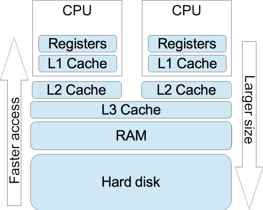
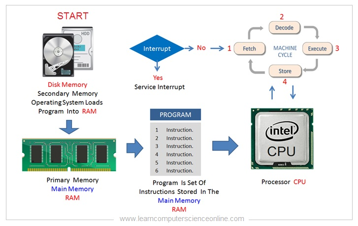
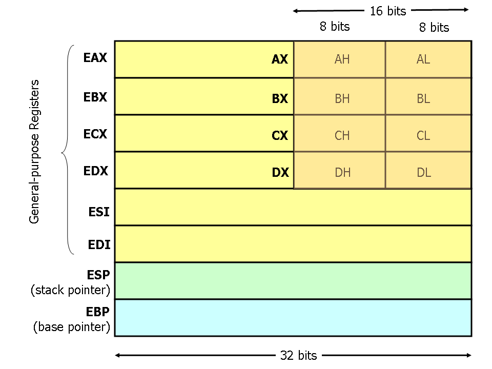
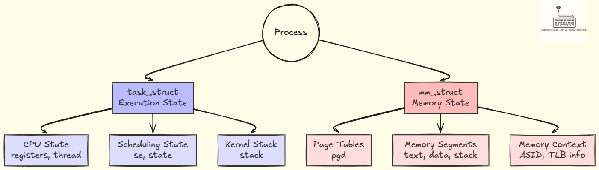
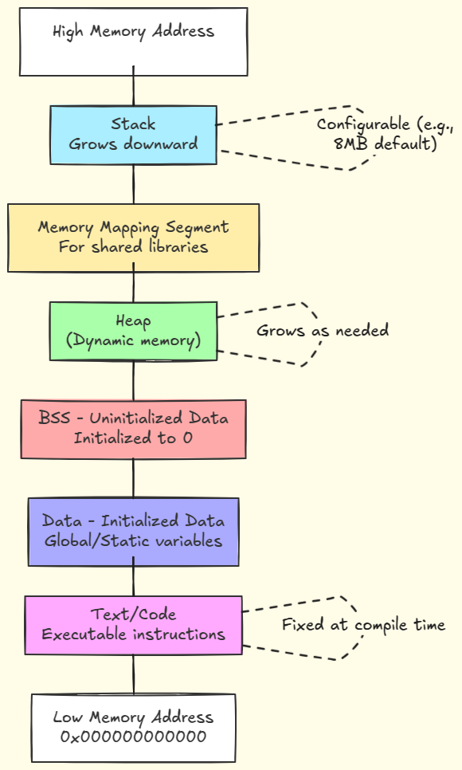

#+title: Stack Zero
#+SUBTITLE: Arquitectura de computadoras, organización de procesos, la pila y GDB
#+AUTHOR: Rising Edge - Enrique
#+DATE: 2026-05-19

:reveal_properties:
#+REVEAL_ROOT: https://cdn.jsdelivr.net/npm/reveal.js
#+OPTIONS: timestamp:nil toc:1 num:nil
#+REVEAL_THEME: dracula
:end:

* Ejercicio
#+begin_src c
/*
 * phoenix/stack-zero, by https://exploit.education
 *
 * The aim is to change the contents of the changeme variable.
 */

#include <stdio.h>
#include <stdlib.h>
#include <string.h>
#include <unistd.h>

#define BANNER \
  "Welcome to " LEVELNAME ", brought to you by https://exploit.education"

char *gets(char *);

int main(int argc, char **argv) {
  struct {
    char buffer[64];
    volatile int changeme;
  } locals;

  printf("%s\n", BANNER);

  locals.changeme = 0;
  gets(locals.buffer);

  if (locals.changeme != 0) {
    puts("Well done, the 'changeme' variable has been changed!");
  } else {
    puts(
        "Uh oh, 'changeme' has not yet been changed. Would you like to try "
        "again?");
  }

  exit(0);
}
#+end_src

* Teoría
** Arquitectura de computadoras (Speedrun)
*** CPU, Registros y RAM
:PROPERTIES:
:reveal_background: #d3d3d3
:END:

Fuente: [[https://www.herongyang.com/Linux/Memory-Layers-and-Access-Speed.html][heronyang.com]]

*** Ciclo de ejecución de CPU

*** Arquitectura de registros (x86 vs x86-64)
#+ATTR_HTML: :width 60% :align center

Fuente: [[https://www.cs.virginia.edu/~evans/cs216/guides/x86.html][CS 216 Virginia]]

** Organización de un proceso en memoria (Linux)
#+ATTR_HTML: :align center

Fuente: [[https://blog.codingconfessions.com/p/linux-context-switching-internals][codingconfessions.com]]

*** Estructura general
#+ATTR_HTML: :width 40% :align center

Fuente: [[https://blog.codingconfessions.com/p/linux-context-switching-internals][codingconfessions.com]]

*** Segmento de Texto (código)
- Contiene instrucciones en lenguaje máquina legibles por la CPU.
- Es de *solo lectura* (~Read-Only~). Modificarlo directamente provoca un ~Segmentation Fault~.

*** Segmento de Datos y BSS
- *Datos (.data):* Almacena variables globales y estáticas que ya poseen un
  valor inicializado en el código.
- *BSS (.bss):* Almacena variables globales y estáticas no inicializadas. Se
  rellenan con ceros de forma automática al arrancar.

*** Segmento de Heap
    - Espacio reservado para memoria dinámica solicitada explícitamente por un
      programador(a) (vía ~malloc~ / ~calloc~).
    - Crece dinámicamente hacia *direcciones de memoria más altas* (hacia
      arriba).

*** Segmento de Pila
    - *Propósito:* Almacena argumentos de funciones, direcciones de retorno y
      todas las *variables locales* del reto.
    - *Dinámica crucial:* Crece hacia *direcciones de memoria más bajas* (hacia
      abajo)

** La pila y llamadas a funciones
[[https://youtu.be/u_-oQx_4jvo?t=224]]

* Verificación en GDB
#+begin_src
file stack-zero
gdb -q stack-zero
info functions
break main
disassemble main
run
break *0x400601
break *0x40060c
define hook-stop
info registers
x/24wx $rsp
x/2i $rip
end
step instruction
# Usar 16 'A's e inspeccionar la pila
restart
run
# Usar 16 'A's y 16 'B's
# Cambiar cada 16 letras y repetir hasta desbordar
quit
#+end_src

* Gracias (:
#+begin_quote
everything is open source if you know how to read assembly.
#+end_quote
